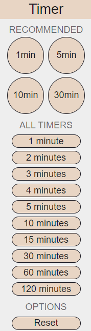

# Timer Extension
A Chrome extension that allows you to easily create timers from anywhere in your browser.

## Screenshots

## Installation
1. Run `git clone https://github.com/PouyaMT/timer-extension.git` to clone the repository.
   
2. Go to your browser's extension manager.

3. Make sure developer mode is turned on.
   
5. Choose to load the file unpacked.

6. Select and open the folder.
